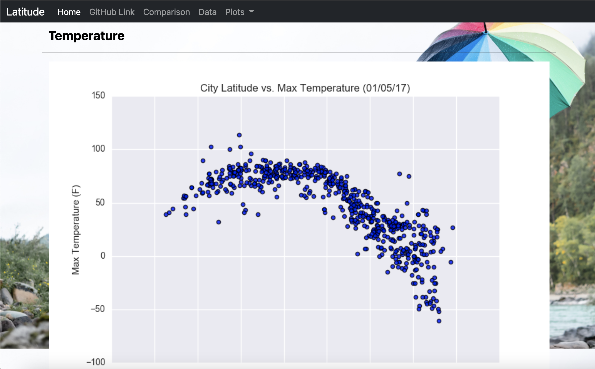
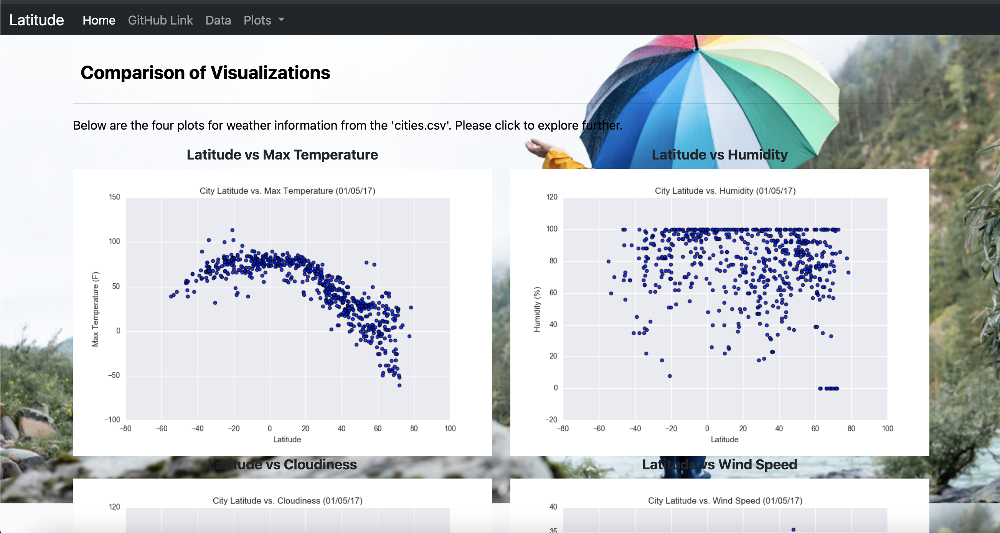

# *Latitude with Attitude*

## **Background**

Utilizing what we have learned about html, CSS, and Bootstrap, we were tasked with designing a website to share the visualizations from various analysis in respect to latitude.

As a part of the website design, seven pages were required:
1. [Landing Page](https://github.com/HeathMo/web_design_challenge/blob/main/Web_Visualizations/intro.html)
2. [Four Visualization Pages](https://github.com/HeathMo/web_design_challenge/blob/main/Web_Visualizations/visuals_1.html)
3. [Comparison Page](https://github.com/HeathMo/web_design_challenge/blob/main/Web_Visualizations/compare.html)
4. [Data Page](https://github.com/HeathMo/web_design_challenge/blob/main/Web_Visualizations/data.html)

## **Pages**

### Landing Page

I designed a responsive landing page (Home) to display being used.  Below are images depicting how the website appears at different sizes.

*Image 1: Large Landing Page*

*Image 2: Small Landing Page*

### Visualizations

I designed individual pages to provide greater detail into the plots of the various analysis relative to latitude.  Below are images from one of those responsive pages.

*Image 3: Large Visualization Page*

*Image 4: Small Visualization Page*

### Comparisons

I created a page capturing all four visualizations for comparison and designed it to be responsive.  Below are images from the page.

*Image 5: Large Comparison Page*

*Image 6: Small Comparison Page*

### Data

Using Jupyter Notebook, I converted the csv to an html file in order to incorporate the data as a table on the data page.  Below is an image of the page.

*Image 7: Data Page*

**It may not be perfect but it was fun!**
